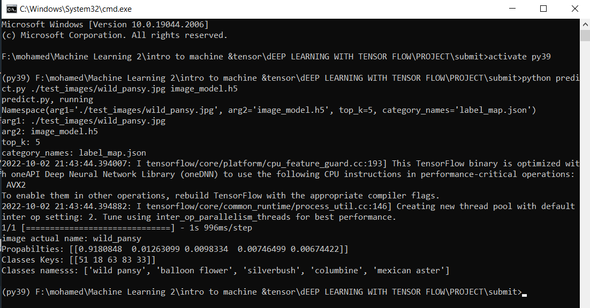

# Image-Classifier
- That's my final project in Intro to machine learning with tensorflow Nanodegree program and was accepted succefully

Can you imagine using something like a phone app that tells you the name of the flower your camera is looking at?

In this projet we have applied deeplearning techniques to train an image classifier to recognize different species of flowers.
and tells you the predicte names of the flower with propability for each of them.

we have used the MobileNet pre-trained model from TensorFlow Hub to get the image features. Build and train a new feed-forward classifier using those features.

- data:
we used tensorflow_datasets to load the `Oxford Flowers 102 dataset`. 

- My Command Line Application
Now we have built and trained a deep neural network on the flower data set, it's time to convert it into an application that others can use.

- The best way to get the command line input into the scripts is with the `argparse` module
- In orer to use the program you only need to pass this command:
-- `python predict.py /path/to/image saved_model`
 specifically this one `python predict.py ./test_images/orchid.jpg my_model.h5`
- with options:

1. `python predict.py ./test_images/orchid.jpg my_model.h5 --top_k 3`
2. Use a label_map.json file to map labels to flower names:
  `python predict.py ./test_images/wildpansy.jpg my_model.h5 --category_names label_map.json`
